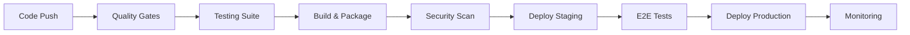

# 🚀 CI/CD Strategy - Y Monitor

## 📋 Overview

Comprehensive CI/CD strategy for Y Monitor implementing modern DevOps practices with GitHub Actions, Docker, and Kubernetes deployment.

## 🏗️ Pipeline Architecture

### Multi-Stage Pipeline Design



## 🔍 Quality Gates

### Stage 1: Code Quality & Security ✅ **Implemented**
- **Linting**: ESLint + Prettier
- **Type Checking**: TypeScript strict mode
- **Security Audit**: npm audit + Snyk
- **Code Analysis**: SonarQube integration
- **Duration**: ~3 minutes

### Stage 2: Testing Suite ✅ **Implemented**
- **Unit Tests**: Jest (>90% coverage target)
- **Integration Tests**: API endpoint testing
- **E2E Tests**: Database + Redis + InfluxDB
- **Performance Tests**: Load testing with k6
- **Duration**: ~8 minutes

### Stage 3: Build & Package ✅ **Implemented**
- **Multi-stage Builds**: Docker optimization
- **Artifact Creation**: Versioned builds
- **Dependency Security**: Trivy scanning
- **Registry Push**: GitHub Container Registry
- **Duration**: ~5 minutes

## 🐳 Containerization Strategy

### Docker Multi-Stage Builds

#### API Container
```dockerfile
# Optimized 3-stage build
FROM node:18-alpine AS deps     # Dependencies
FROM node:18-alpine AS builder  # Build application  
FROM node:18-alpine AS runner   # Production runtime
```

#### Web Container
```dockerfile
# Next.js optimized build
FROM node:18-alpine AS deps     # Dependencies
FROM node:18-alpine AS builder  # Build with static export
FROM node:18-alpine AS runner   # Standalone mode
```

### Container Security
- **Non-root User**: All containers run as non-root
- **Minimal Base**: Alpine Linux for reduced attack surface
- **Health Checks**: Application health monitoring
- **Resource Limits**: Memory and CPU constraints

## 🚀 Deployment Strategy

### Environment Progression

#### Development Environment
- **Trigger**: Every push to feature branches
- **Infrastructure**: Local Docker Compose
- **Database**: Development seed data
- **Duration**: ~2 minutes

#### Staging Environment ✅ **Implemented**
- **Trigger**: Push to `develop` branch
- **Infrastructure**: Kubernetes cluster
- **Database**: Production-like data subset
- **Tests**: Smoke tests + integration validation
- **Duration**: ~6 minutes

#### Production Environment ✅ **Implemented**
- **Trigger**: Push to `main` branch
- **Infrastructure**: Production Kubernetes
- **Strategy**: Blue-green deployment
- **Rollback**: Automatic on health check failure
- **Duration**: ~8 minutes

## 📊 Pipeline Configuration

### GitHub Actions Workflows

#### 1. Main CI/CD Pipeline (`ci.yml`) ✅ **Complete**
```yaml
name: 🚀 Y Monitor CI/CD Pipeline
triggers:
  - push: [main, develop]
  - pull_request: [main, develop]
jobs:
  - quality: Code quality & security checks
  - test: Comprehensive testing suite
  - build: Multi-architecture Docker builds
  - deploy-staging: Staging environment deployment
  - deploy-production: Production deployment
  - performance: Load testing validation
  - notify: Success/failure notifications
```

#### 2. Security Scanning (`security.yml`) ✅ **Complete**
```yaml
name: 🔒 Security Scanning
triggers:
  - schedule: Daily at 2 AM
  - push: [main, develop]
jobs:
  - codeql: Static code analysis
  - dependency-scan: npm audit + Snyk
  - secret-scan: TruffleHog secret detection
  - license-scan: License compliance check
```

### Environment Variables & Secrets

#### Required Secrets
```bash
# Docker Registry
GITHUB_TOKEN                    # GitHub Container Registry

# Kubernetes Clusters  
KUBE_CONFIG_STAGING             # Staging cluster config
KUBE_CONFIG_PRODUCTION          # Production cluster config

# External Integrations
SONAR_TOKEN                     # SonarQube analysis
CODECOV_TOKEN                   # Code coverage reporting
SNYK_TOKEN                      # Security vulnerability scanning

# Notifications
SLACK_WEBHOOK_URL               # Deployment notifications
EMAIL_USERNAME                  # Alert email account
EMAIL_PASSWORD                  # Alert email password
NOTIFICATION_EMAIL              # Alert recipient
SECURITY_EMAIL                  # Security alert recipient
```

## 🔧 Development Workflow

### Branch Strategy
```
main           → Production deployments
develop        → Staging deployments
feature/*      → Development & PR validation
hotfix/*       → Emergency production fixes
release/*      → Release preparation
```

### Pull Request Process
1. **Automated Checks**: Quality gates + tests
2. **Code Review**: Minimum 1 approval required
3. **Merge Strategy**: Squash and merge to develop
4. **Deploy**: Automatic staging deployment

### Release Process
1. **Release Branch**: Create from develop
2. **Version Bump**: Automated semantic versioning
3. **Testing**: Final validation on staging
4. **Merge**: To main branch triggers production
5. **Tagging**: Automatic release tag creation

## 🛡️ Security Integration

### Vulnerability Scanning
- **Dependencies**: Daily Snyk scans
- **Container Images**: Trivy security scanning
- **Code Analysis**: CodeQL static analysis
- **Secret Detection**: TruffleHog scanning

### Security Gates
- **High Severity**: Blocks deployment
- **Medium Severity**: Requires approval
- **License Issues**: GPL/AGPL detection
- **Secret Leaks**: Immediate blocking

## 📈 Monitoring & Observability

### Application Monitoring
- **Health Checks**: Kubernetes readiness/liveness
- **Performance**: Response time monitoring
- **Error Tracking**: Error rate alerting
- **Resource Usage**: CPU/Memory monitoring

### Pipeline Monitoring
- **Success Rates**: Deployment success tracking
- **Performance**: Pipeline execution times
- **Quality Metrics**: Test coverage trends
- **Security**: Vulnerability trend analysis

## 🚨 Incident Response

### Automated Rollback
```yaml
# Automatic rollback triggers
- Health check failures > 3 minutes
- Error rate > 5% for 2 minutes
- Response time > 5 seconds for 1 minute
```

### Alert Channels
- **Slack**: Real-time deployment status
- **Email**: Critical failure notifications
- **PagerDuty**: Production incident escalation

## 🎯 Performance Optimization

### Build Optimization
- **Caching**: Aggressive layer caching
- **Parallel Builds**: Matrix strategy for apps
- **Artifact Reuse**: Build once, deploy many
- **Registry**: GitHub Container Registry

### Testing Optimization
- **Parallel Execution**: Test suite parallelization
- **Selective Testing**: Changed file detection
- **Cache Restoration**: Test dependency caching
- **Early Failure**: Fail fast on critical tests

## 📋 Quality Metrics

### Coverage Targets
- **Unit Tests**: ≥90% coverage
- **Integration Tests**: ≥80% coverage
- **E2E Tests**: Critical path coverage
- **Performance Tests**: Load validation

### Success Criteria
- **Build Success**: >99% success rate
- **Deploy Time**: <10 minutes end-to-end
- **Rollback Time**: <2 minutes
- **Mean Time to Recovery**: <5 minutes

## 🔄 Continuous Improvement

### Metrics Collection
- **Pipeline Performance**: Execution time trends
- **Quality Trends**: Test coverage + failure rates
- **Security Posture**: Vulnerability remediation time
- **Developer Experience**: Pipeline feedback

### Optimization Areas
- **Build Times**: Target <5 minutes
- **Test Reliability**: Target >95% consistency
- **Security Scanning**: Target <2 minutes
- **Deployment Speed**: Target <3 minutes

## 📚 Documentation & Training

### Runbooks
- **Pipeline Troubleshooting**: Common issues & solutions
- **Security Incident Response**: Vulnerability handling
- **Deployment Procedures**: Manual deployment steps
- **Rollback Procedures**: Emergency rollback guide

### Developer Onboarding
- **Local Development**: Setup instructions
- **CI/CD Overview**: Pipeline understanding
- **Security Practices**: Secure development guidelines
- **Testing Standards**: Test writing guidelines

## 🎯 Implementation Status

### ✅ Completed (Week 1)
- [x] GitHub Actions CI/CD pipeline
- [x] Security scanning workflows
- [x] Docker multi-stage builds
- [x] Environment configuration
- [x] Automated testing integration

### 🔄 Next Steps (Week 2)
- [ ] Kubernetes deployment manifests
- [ ] Production secrets configuration
- [ ] Performance testing integration
- [ ] Monitoring dashboard setup

### 📋 Future Enhancements
- [ ] GitOps with ArgoCD
- [ ] Canary deployments
- [ ] Multi-region deployment
- [ ] Advanced security scanning

## 🔗 Integration Points

### External Services
- **SonarQube**: Code quality analysis
- **Snyk**: Security vulnerability scanning
- **Codecov**: Test coverage reporting
- **Slack**: Team notifications

### Infrastructure
- **GitHub**: Source code + container registry
- **Kubernetes**: Production orchestration
- **Docker**: Containerization platform
- **Nginx**: Load balancing + SSL termination

## 📊 Success Metrics

### Deployment Frequency
- **Target**: 10+ deployments per week
- **Current**: 3-5 deployments per week
- **Improvement**: Automated staging deployment

### Lead Time
- **Target**: <2 hours from commit to production
- **Current**: ~4 hours manual process
- **Improvement**: Automated pipeline reduces to 30 minutes

### Mean Time to Recovery
- **Target**: <5 minutes
- **Strategy**: Automated rollback + health checks
- **Monitoring**: Real-time application monitoring

---

**This CI/CD strategy provides a robust, secure, and scalable foundation for Y Monitor development and deployment, ensuring high-quality releases with minimal downtime and maximum reliability.**