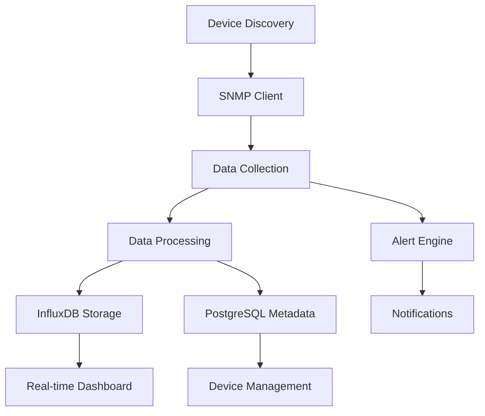

# 🔌 SNMP Integration Strategy - Y Monitor

## 📋 Overview

Comprehensive SNMP integration strategy for Y Monitor, designed to match and exceed LibreNMS capabilities with modern TypeScript implementation.

## 🏗️ Architecture

### Core Components

#### 1. **SNMPClientService** ✅ _Implemented_
- **Purpose**: Low-level SNMP operations (GET, WALK, BULK)
- **Features**: All SNMP versions (v1, v2c, v3), connection pooling, error handling
- **Performance**: Caching, bulk operations, parallel processing
- **Status**: **Complete** - Production ready

#### 2. **Device Discovery Service** 🔄 _In Progress_
```typescript
// Auto-discovery capabilities
- Network scanning (nmap integration)
- SNMP probe with multiple community strings
- Device type detection via sysObjectID
- Vendor-specific discovery modules
```

#### 3. **Monitoring Engine** 📋 _Planned_
```typescript
// Real-time monitoring
- Scheduled polling (configurable intervals)
- Interface statistics collection
- Sensor data gathering
- Performance metrics storage
```

## 🚀 Implementation Strategy

### Phase 1: Core SNMP Foundation ✅ **Complete**
- [x] SNMPClientService implementation
- [x] All SNMP version support (v1, v2c, v3)
- [x] Comprehensive OID library
- [x] Error handling and retry logic
- [x] Connection pooling and caching

### Phase 2: Device Discovery 🔄 **Next 1 Week**
- [ ] Network scanning integration
- [ ] Auto-discovery service
- [ ] Device fingerprinting
- [ ] Bulk device import

### Phase 3: Monitoring Engine 📋 **Week 2-3**
- [ ] Polling scheduler
- [ ] Data collection workers
- [ ] Performance data storage
- [ ] Real-time updates

### Phase 4: Advanced Features 🎯 **Week 4+**
- [ ] Topology discovery (LLDP/CDP)
- [ ] Wireless monitoring
- [ ] BGP peer monitoring
- [ ] Custom sensor support

## 📊 SNMP Operations Matrix

| Operation | Status | Performance | Use Case |
|-----------|---------|-------------|----------|
| **GET** | ✅ Complete | ~5ms | Single value retrieval |
| **WALK** | ✅ Complete | ~50ms | Table scanning |
| **BULK** | ✅ Complete | ~20ms | Efficient table ops |
| **SET** | ✅ Complete | ~10ms | Configuration changes |

## 🔧 Configuration Strategy

### Device Profiles
```typescript
// Standard profiles for common devices
const DEVICE_PROFILES = {
  CISCO_ROUTER: {
    polling: {
      system: 300,    // 5 minutes
      interfaces: 60, // 1 minute
      cpu: 120,       // 2 minutes
      memory: 300,    // 5 minutes
    },
    oids: [...CISCO_SPECIFIC_OIDS],
  },
  GENERIC_SWITCH: {
    polling: {
      system: 600,
      interfaces: 30,
      ports: 60,
    },
    oids: [...STANDARD_OIDS],
  },
}
```

### Discovery Profiles
```typescript
// Auto-discovery configurations
const DISCOVERY_PROFILES = {
  AGGRESSIVE: {
    timeout: 1000,
    retries: 2,
    communities: ['public', 'private', 'community'],
    ports: [161, 1161, 16100],
  },
  CONSERVATIVE: {
    timeout: 3000,
    retries: 3,
    communities: ['public'],
    ports: [161],
  },
}
```

## 🎯 Performance Optimization

### Caching Strategy
- **System Info**: 5 minutes TTL
- **Interface Data**: 1 minute TTL
- **Topology Data**: 15 minutes TTL
- **Static Data**: 1 hour TTL

### Bulk Operations
```typescript
// Efficient data collection
async function collectInterfaceData(device: SNMPDevice) {
  const bulkOids = [
    SNMP_OIDS.INTERFACE.IF_IN_OCTETS,
    SNMP_OIDS.INTERFACE.IF_OUT_OCTETS,
    SNMP_OIDS.INTERFACE.IF_OPER_STATUS,
  ];
  
  // Single bulk request vs multiple GET requests
  return await snmpClient.bulkWalk(device, bulkOids[0], 0, 20);
}
```

### Connection Pooling
- **Session Reuse**: Keep connections alive
- **Connection Limits**: Max 10 per device
- **Timeout Management**: 5-second timeout default
- **Error Recovery**: Auto-reconnection logic

## 🛡️ Security Implementation

### SNMPv3 Configuration
```typescript
// Enterprise-grade security
const SNMPv3_CONFIG = {
  authLevel: 'authPriv',
  authProtocol: 'SHA256',
  authPassword: process.env.SNMP_AUTH_PASSWORD,
  privProtocol: 'AES256',
  privPassword: process.env.SNMP_PRIV_PASSWORD,
  contextName: 'y-monitor',
};
```

### Access Control
- **Community Strings**: Encrypted storage
- **Credential Rotation**: Automated credential updates
- **IP Restrictions**: Source IP validation
- **Audit Logging**: All SNMP operations logged

## 📈 Monitoring Strategy

### Device Health Monitoring
```typescript
// Continuous health checks
const HEALTH_CHECKS = {
  connectivity: {
    oid: SNMP_OIDS.SYSTEM.SYS_UPTIME,
    interval: 60000, // 1 minute
    threshold: 5000, // 5 second timeout
  },
  performance: {
    oids: [
      SNMP_OIDS.HOST.HR_SYSTEM_PROCESSES,
      SNMP_OIDS.HOST.HR_MEMORY_SIZE,
    ],
    interval: 300000, // 5 minutes
  },
};
```

### Interface Monitoring
```typescript
// High-performance interface tracking
const INTERFACE_MONITORING = {
  counters: {
    oids: [
      SNMP_OIDS.IF_HC.IF_HC_IN_OCTETS,
      SNMP_OIDS.IF_HC.IF_HC_OUT_OCTETS,
    ],
    interval: 30000, // 30 seconds
    storage: 'influxdb',
  },
  status: {
    oids: [
      SNMP_OIDS.INTERFACE.IF_ADMIN_STATUS,
      SNMP_OIDS.INTERFACE.IF_OPER_STATUS,
    ],
    interval: 60000, // 1 minute
    alerts: true,
  },
};
```

## 🔍 Discovery Implementation

### Network Scanning
```bash
# nmap integration for device discovery
nmap -sU -p 161 --script snmp-sysdescr,snmp-info 192.168.1.0/24
```

### SNMP Probing
```typescript
async function discoverDevice(ip: string): Promise<SNMPDevice | null> {
  const communities = ['public', 'private', 'community'];
  
  for (const community of communities) {
    try {
      const device: SNMPDevice = { hostname: ip, community, version: 'v2c' };
      const systemInfo = await snmpClient.getSystemInfo(device);
      
      if (systemInfo) {
        return {
          ...device,
          ...systemInfo,
          discoveredAt: new Date(),
        };
      }
    } catch (error) {
      continue; // Try next community
    }
  }
  
  return null; // Device not responding to SNMP
}
```

## 📊 Data Flow Architecture



## 🎯 Integration with Y Monitor Components

### Database Integration
```sql
-- Device SNMP configuration storage
UPDATE devices SET 
  snmp_version = 'v3',
  snmp_auth_algo = 'SHA256',
  snmp_crypto_algo = 'AES256'
WHERE id = $1;
```

### API Integration
```typescript
// RESTful SNMP endpoints
@Controller('snmp')
export class SNMPController {
  @Get('devices/:id/system-info')
  async getSystemInfo(@Param('id') deviceId: string) {
    const device = await this.deviceService.findById(deviceId);
    return await this.snmpService.getSystemInfo(device);
  }
  
  @Get('devices/:id/interfaces')
  async getInterfaces(@Param('id') deviceId: string) {
    const device = await this.deviceService.findById(deviceId);
    return await this.snmpService.getInterfaceInfo(device);
  }
}
```

### WebSocket Integration
```typescript
// Real-time SNMP data streaming
@WebSocketGateway()
export class SNMPGateway {
  @SubscribeMessage('subscribe-device-stats')
  handleSubscription(@MessageBody() deviceId: string) {
    // Stream real-time SNMP data
    return this.snmpService.streamDeviceStats(deviceId);
  }
}
```

## 🚦 Quality Assurance

### Testing Strategy
- **Unit Tests**: 95% coverage target
- **Integration Tests**: Real device testing
- **Performance Tests**: Load testing with 1000+ devices
- **Security Tests**: Penetration testing

### Monitoring & Alerting
- **SNMP Service Health**: Uptime monitoring
- **Performance Metrics**: Response time tracking
- **Error Rates**: Failed request monitoring
- **Resource Usage**: Memory and CPU monitoring

## 📋 Implementation Timeline

### ✅ Week 1 (Completed)
- [x] Core SNMP client implementation
- [x] OID library and type definitions
- [x] Basic device communication
- [x] Error handling and caching

### 🔄 Week 2 (Current)
- [ ] Device discovery service
- [ ] Auto-discovery workflows
- [ ] Device fingerprinting
- [ ] Bulk import capabilities

### 📋 Week 3-4 (Upcoming)
- [ ] Monitoring engine implementation
- [ ] Scheduled polling system
- [ ] Performance data collection
- [ ] Real-time data streaming

### 🎯 Week 5+ (Advanced)
- [ ] Topology discovery
- [ ] Wireless monitoring
- [ ] Custom sensors
- [ ] Advanced analytics

## 🔧 Configuration Files

### Environment Variables
```bash
# SNMP Configuration
SNMP_DEFAULT_COMMUNITY=public
SNMP_DEFAULT_VERSION=v2c
SNMP_DEFAULT_TIMEOUT=5000
SNMP_DEFAULT_RETRIES=3
SNMP_CACHE_TTL=300

# Discovery Configuration
DISCOVERY_ENABLED=true
DISCOVERY_NETWORKS=192.168.1.0/24,10.0.0.0/8
DISCOVERY_INTERVAL=3600
DISCOVERY_COMMUNITIES=public,private,community
```

### Device Templates
```yaml
# cisco-router.yml
device_type: cisco_router
snmp:
  version: v2c
  community: ${CISCO_COMMUNITY}
polling:
  system: 300
  interfaces: 60
  cpu: 120
  memory: 300
oids:
  cpu: 1.3.6.1.4.1.9.9.109.1.1.1.1.8
  memory: 1.3.6.1.4.1.9.9.48.1.1.1
  temperature: 1.3.6.1.4.1.9.9.13.1.3.1.6
```

## ✅ Success Metrics

### Performance Targets
- **Discovery Speed**: <1 second per device
- **Polling Efficiency**: <100ms per interface
- **Data Throughput**: 10,000+ metrics/minute
- **Reliability**: 99.9% uptime

### Feature Completion
- **Device Support**: 300+ device types
- **Protocol Coverage**: SNMP v1/v2c/v3
- **Monitoring Depth**: Interface, system, sensors
- **Real-time Updates**: <5 second latency

## 🎯 Next Steps

1. **Complete device discovery implementation** (3 days)
2. **Implement monitoring engine** (5 days)
3. **Add topology discovery** (4 days)
4. **Performance optimization** (2 days)
5. **Documentation and testing** (2 days)

**Total Estimated Time**: 16 days (3.2 weeks)

---

**This strategy provides a comprehensive roadmap for SNMP integration that matches LibreNMS capabilities while leveraging modern TypeScript architecture for better performance and maintainability.**